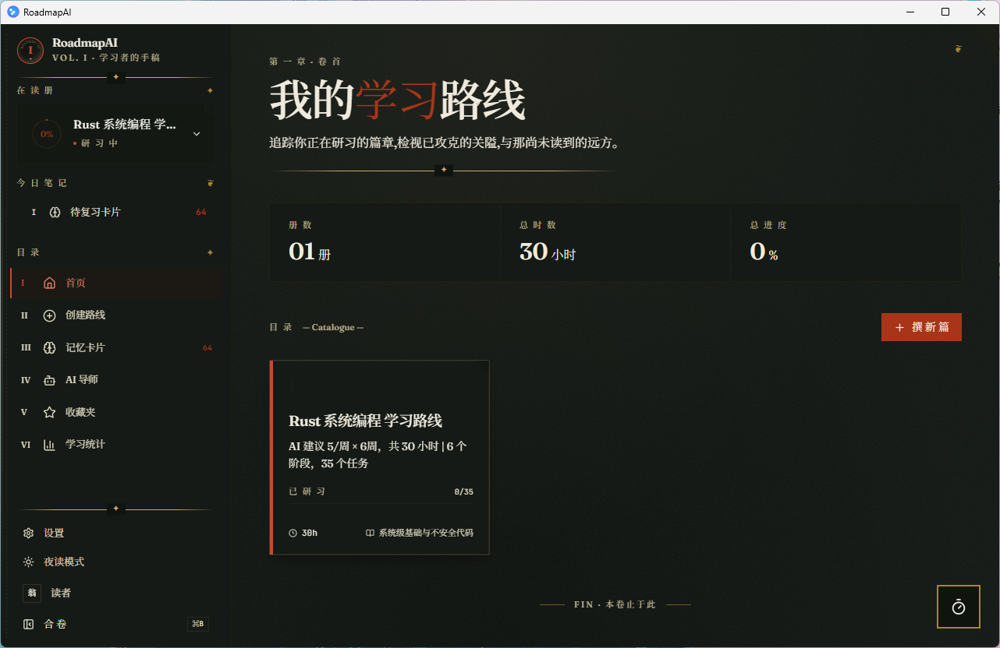
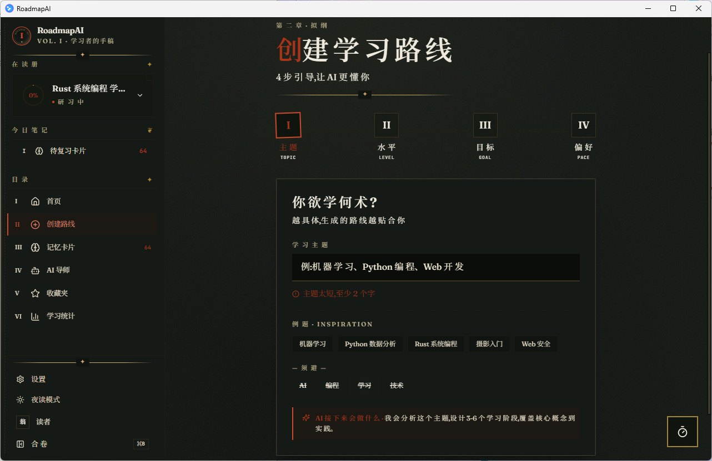
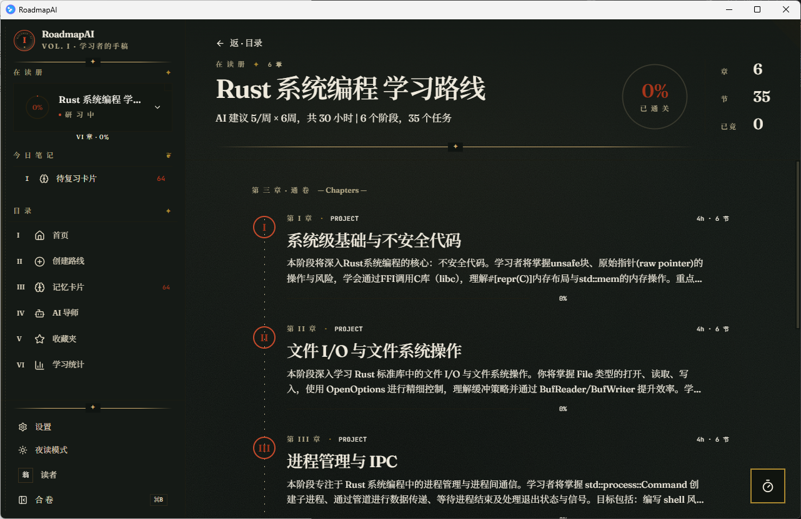
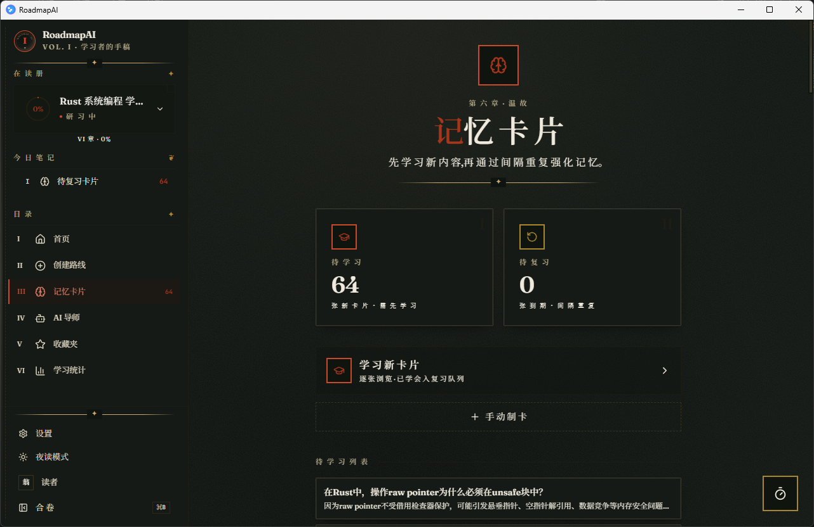
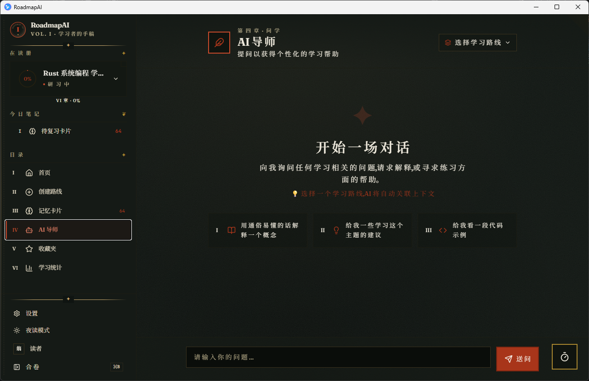
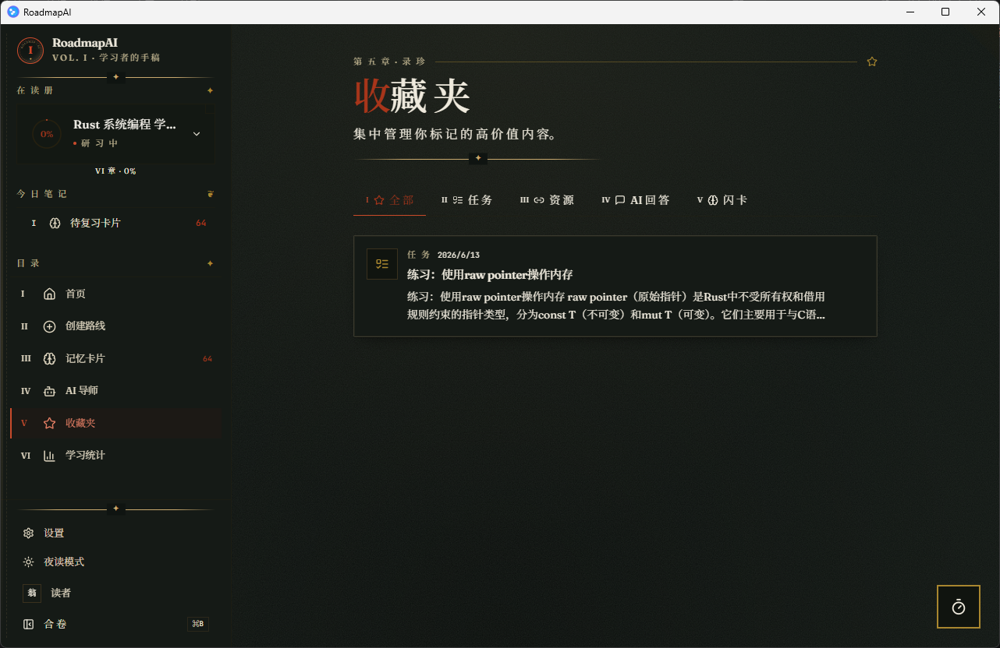

<p align="center">
  <h1 align="center">RoadmapAI</h1>
  <p align="center">AI 驱动的个性化学习路线生成器</p>
</p>

<p align="center">
  
  
  
  
  
</p>

<p align="center">
  
</p>

---

## 📸 预览 / Preview

| 首页 · 我的学习路线 | 撰新篇 · AI 生成路线 |
|:---:|:---:|
|  |  |
| **路线详情 · 阶段与任务** | **抽认卡 · SM-2 间隔重复** |
|  |  |
| **AI 导师 · 流式对话** | **收藏夹 · 直达内容** |
|  |  |

> 📂 截图存放在 [`docs/screenshots/`](docs/screenshots/)。本地预览时相对路径即可；若推送到 GitHub 后图片未显示，请确认仓库为 **public** 或已开启 Pages 资源代理。

---

## 简介 / Introduction

一个基于 Tauri 2 的桌面应用，利用 AI 为学习者生成个性化的学习路线图，并集成基于 SM-2 算法的间隔重复抽认卡系统。

A Tauri 2 desktop app that uses AI to generate personalized learning roadmaps with SM-2 spaced repetition flashcards.

## ✨ 功能 / Features

- **AI 生成学习路线** — 描述你想学的内容，AI 自动生成阶段、任务和资源
- **三层并行生成** — 协调器 → 阶段 → 任务内容，并行加速
- **进度追踪** — 可视化任务完成进度，支持阶段过关测验
- **资源自动搜索** — 集成 Tavily API，自动搜索学习资源（可选）
- **间隔重复抽认卡** — 基于 SM-2 算法的闪卡复习系统
- **AI 导师对话** — 随时随地提问，流式回复
- **多 AI 提供商** — 支持 OpenAI、Claude、Gemini 及自定义兼容 API
- **深色/浅色主题** — 护眼模式，一键切换
- **本地数据存储** — SQLite 本地数据库，无需联网即可使用
- **手稿视觉风格** — 全局采用「学者的手稿」设计语言(Fraunces / Newsreader / JetBrains Mono,墨黑 + 朱砂 + 米色 + 金箔,罗马章节号、印章、朱批、金箔分隔线)
- **收藏夹直达内容** — 收藏的「任务 / 资源」点击后直接弹模态展示内容与资源链接,无需再展开路线

---

## 🏗️ 技术栈 / Tech Stack

| 层级 | 技术 |
|------|------|
| 框架 | [Tauri 2](https://v2.tauri.app) |
| 前端 | React 18 + TypeScript + Vite 5 + Tailwind CSS 3 |
| 状态管理 | Zustand 5 |
| 路由 | React Router v6 |
| Markdown | react-markdown + rehype-highlight |
| 后端 | Rust + tokio (async) |
| 数据库 | SQLite (sqlx 0.8) |
| HTTP | reqwest 0.12 |
| AI | OpenAI / Anthropic / Google Gemini / Custom API |

---

## 📁 项目结构 / Project Structure

```
├── src/                        # React 前端
│   ├── components/             # 可复用组件 (Layout, QuizModal)
│   │   ├── manuscript/         # 品牌徽 / 罗马数字工具(手稿视觉原子)
│   │   ├── states/             # Loading / Empty / Error / Skeleton 公共组件
│   │   ├── wizard/             # 创建路线 wizard 步骤
│   │   ├── ai-loop/            # 消息→任务/卡片/资源的抽屉
│   │   ├── drawer/             # 通用 SideDrawer
│   │   ├── onboarding/         # 首次引导步骤
│   │   └── sidebar/            # 侧边栏 4 个子组件
│   ├── pages/                  # 页面组件
│   │   ├── HomePage.tsx        # 首页仪表盘
│   │   ├── CreateRoadmapPage.tsx  # 创建路线
│   │   ├── RoadmapDetailPage.tsx  # 路线详情与进度
│   │   ├── FlashcardsPage.tsx  # 抽认卡复习
│   │   ├── AiTutorPage.tsx     # AI 导师对话
│   │   ├── FavoritesPage.tsx   # 收藏夹
│   │   ├── StatsPage.tsx       # 学习统计
│   │   ├── OnboardingPage.tsx  # 首次引导
│   │   └── SettingsPage.tsx    # 设置 (API密钥/主题)
│   ├── stores/                 # Zustand 状态管理
│   ├── types.ts                # TypeScript 类型定义
│   └── utils/                  # 工具函数 (markdown 渲染 / 闪卡预览)
├── src-tauri/                  # Rust 后端
│   ├── src/
│   │   ├── commands/           # Tauri 命令
│   │   │   ├── roadmap.rs      # 路线生成与 CRUD
│   │   │   ├── flashcard.rs    # SM-2 抽认卡
│   │   │   ├── chat.rs         # AI 对话
│   │   │   ├── ai_loop.rs      # AI 回路(消息→任务/卡片/资源)
│   │   │   ├── favorites.rs    # 收藏夹
│   │   │   ├── stats.rs        # 学习统计
│   │   │   └── settings.rs     # API 配置
│   │   ├── db/mod.rs           # SQLite 数据库层
│   │   ├── models/mod.rs       # 数据模型
│   │   └── services/
│   │       ├── ai.rs           # AI 提供商实现
│   │       ├── parallel.rs     # 并行生成
│   │       └── roadmap_parser.rs  # AI 响应解析
│   ├── icons/                  # 应用图标(多尺寸 + 源 SVG/PNG)
│   └── tauri.conf.json         # Tauri 配置
├── docs/
│   └── screenshots/            # README 预览图
└── package.json
```

---

## 🚀 快速开始 / Quick Start

### 环境要求 / Prerequisites

- **Node.js** >= 18
- **Rust** >= 1.70（需安装完整 Rust 开发环境，含 `rustc`、`cargo`。推荐使用 [rustup](https://rustup.rs) 安装）
- **macOS / Windows / Linux**（macOS 需安装 Xcode Command Line Tools；Windows 需安装 Visual Studio Build Tools 或 C++ 生成工具）

### 安装 / Installation

```bash
# 克隆仓库
git clone https://github.com/YOUR_USERNAME/roadmapai.git
cd roadmapai

# 安装前端依赖（Rust 依赖会在首次 tauri dev/build 时自动下载）
npm install
```

### 开发 / Development

```bash
# 启动 Tauri 开发模式（前端 + Rust 后端）
npm run tauri dev
```

> ⚠️ `npm run dev` 仅启动 Vite 前端，不包含 Rust 后端和数据库，Tauri 命令将无法使用。

### 构建 / Build

```bash
# 生产构建
npm run tauri build
```

构建产物位于 `src-tauri/target/release/bundle/`。

---

## ⚙️ 配置 / Configuration

所有 API 密钥通过应用内的**设置页面**配置（不通过 `.env` 文件）。

1. 打开应用 → 点击 **设置**
2. 选择 AI 提供商并填入 API Key：
   - **OpenAI**: https://platform.openai.com
   - **Claude**: https://console.anthropic.com
   - **Gemini**: https://aistudio.google.com
   - **自定义**: 兼容 OpenAI 格式的 API（如 DeepSeek、MiniMax 等）
3. （可选）填入 **Tavily API Key** 以启用自动资源搜索：https://tavily.com

### 模型选择建议

路线生成需要**结构化 JSON 输出**，对话需要**自然语言理解**，不同任务适合不同模型：

| 模型 | 路线生成 | AI 导师对话 | 说明 |
|------|:---:|:---:|------|
| **DeepSeek-V4-Flash** | ⭐ 推荐 | ✅ 可用 | 速度快，JSON 输出稳定，不易截断 |
| **MiniMax-M2.7** | ✅ 可用 | ✅ 可用 | 成本低，速度适中 |
| **MiniMax-M3** | ❌ 不推荐 | ⭐ 推荐 | 推理模型，会花大量 token 在思考上，导致 JSON 截断 |

> 💡 **最佳实践**：路线生成用 DeepSeek-V4-Flash，AI 导师对话用 MiniMax-M3。在设置页面可以分别配置不同模型的自定义接口。

---

## 🎯 使用指南 / Usage

### 创建学习路线

1. 点击首页 **"新建路线"**
2. 输入学习主题，选择当前水平和偏好难度
3. （可选）描述学习目标 — 不填则 AI 自动判断
4. AI 自动评估学习时间和周期，生成包含阶段和任务的个性化路线

### 追踪进度

1. 打开路线查看所有阶段
2. 点击阶段卡片 → 弹出详情框，查看任务、资源、记忆卡
3. 勾选任务标记完成
4. 完成阶段测验以解锁下一阶段
5. 资源链接过期时可直接点击编辑/删除，或手动添加新资源

### 学习与复习抽认卡

1. 进入 **记忆卡片** 页面
2. **先学习**：逐张浏览新卡片，理解内容后点"已学会" — 卡片进入复习队列
3. **后复习**：到期卡片按 SM-2 间隔重复算法出现，根据记忆程度评分
4. 评分提示：😢完全忘记 → 🤩完美回答，hover 可查看详细评分说明

### AI 导师

1. 进入 **AI 导师** 页面
2. 输入问题并发送
3. 获取关于学习内容的个性化帮助（流式回复）

---

## 📄 许可证 / License

MIT © RoadmapAI

---

## 📝 备注 / Notes

- 应用语言界面为**中文**
- API 密钥存储在本地 SQLite 数据库中，不会上传到任何服务器
- 数据库文件位于系统应用数据目录（macOS: `~/Library/Application Support/com.roadmapai.app/`）
- 内置学习计时器（Pomodoro），关闭应用后计时状态自动保存
- ⚠️ 推理模型（如 MiniMax-M3）不适合路线生成，会产生大量推理内容导致 JSON 截断，建议用于 AI 导师对话
- ⚠️ 项目仍存在不少 bug，会逐步修复，欢迎提 issue 反馈
- 无测试、无 CI — TypeScript 严格模式在 `npm run build` 时进行类型检查
- 📸 README 预览图由 [`docs/screenshots/`](docs/screenshots/) 提供；准备好截图后只需将同名文件覆盖即可在 README 看到效果（推荐 16:9，深色主题）
